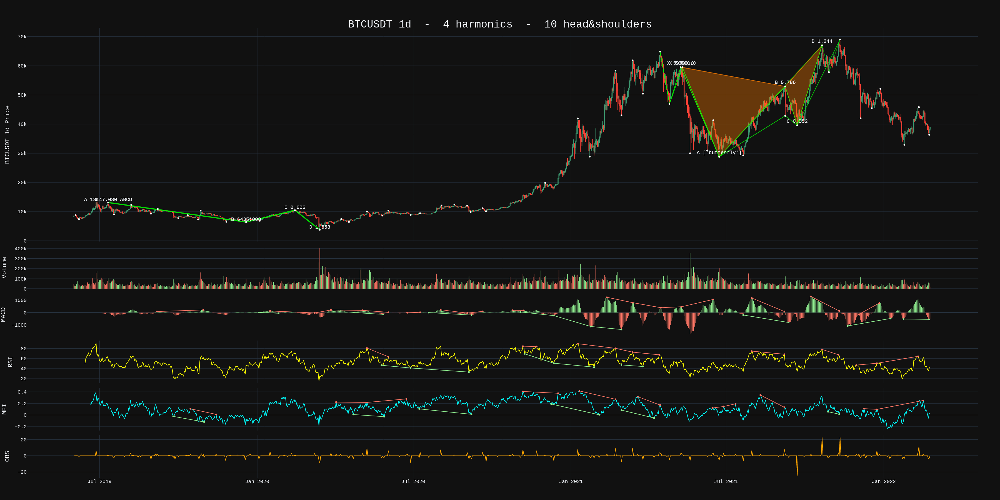

# pythonta
Python tool kit for TA

## What it is?
A simple set of libraries coded around yfinance and the binance-connector pip packages that detect harmonic patterns in stock trends.  The scans are published as images on your PC for you to review.



## What it is not!
This library is **NOT FINANCIAL ADVICE!** This library can detect patterns and that is all.  Nobody in the world, not even with machine learning, can predict where a stock trend is going to move.  Anyone who says they can is a liar.  **There is no certainty in fiancial markets**.  Please do not use this tool with the false assumption that you will learn how to trade.  The tool will merely show you what trends have occured ( **past tense** ).

For more on harmonics or trading visit [Technical Analysis with Mitch Ray](http://mitchrayta.com) and [Scott Carney's Harmonic Trader](http://www.harmonictrader.com)


## Installation

### Windows
Follow the video guide

[Windows Installation Guide](https://www.youtube.com/embed/WQ4W04JqZ7o)

https://youtu.be/WQ4W04JqZ7o

### Linux
Git clone the project then cd into the cloned folder - OR - download the project zip and use the command line to reach the project folder.

```git clone git@github.com:niall-oc/pythonta.git```

Setup a virtual env for dependencies ( my personal preference )

```
python3 -m virtualenv venv
source venv/bin/activate
```

Install all project dependencies.

```pip3 install -r requirements.txt```

There are yaml config files for scanning assets on both binance and yahoo.  Open these files and set the output path to be the folder ( on your pc ) where you want pattern images installed. For example a user on a linux system may choose.

```output_path: /home/me/Pictures/Patterns```

### Settings
* ```settings.yaml``` contains all instructions.
* ```markets.yaml``` lists asset data to scan, is referred to in the settings file and has override instructions contained within.
* ```harmonics.yaml``` fibonnaci retracement config for harmonic patterns. Again referred to in settings file and contains instrucions.

## Using the tool

Using the command promt on windows or the shell on linux.

1. Linux ```cd /home/me/code/pythonta-main```. Windows ```cd c:\users\me\code\pythonta-main```
2. linux ```source venv/bin/activate```. Windows ```venv\Scripts\activate```
3. scan binance on the 1h ```python3 pattern_scanner.py binance_scanner.yaml --interval 1h```
4. scan AAPL for patterns that completed in the last week. ```python3 pattern_scanner.py yahoo_scanner.yaml --interval 1d --limit_to 7```
5. scan BTCUSDT for patterns that are forming right now. ```python3 pattern_scanner.py binance_scanner.yaml --interval 15m --limit_to 5```

### Finviz Pre-Scanner
1. Create a market config file from a configured finviz search. ```python3 utils/finviz_search.py utils/finviz_config.yaml```
2. Create a specified market config file from a specific finviz search. ```python3 utils/finviz_search.py utils/finviz_config.yaml --output_yaml my_finviz_market.yaml --filter_query cap_largeover,earningsdate_nextdays5,ind_stocksonly,sh_avgvol_o1000,sh_opt_option,sh_price_o,geo_usa```

## Bot posts scans to twitter
[Twitter bot](http://twitter.com/ZechsMarquie) is my twitter account which my bot posts to. Going forward I'm going to make this a daily thing with top crypto and stonks!

# Future thangs!
Added
- [x] Patch - Remove Duplicate peaks created by argrelextrema so search is faster.
- [x] Improve - Config better laid out in yaml.  Harmonic retracements can be edited in yaml configs.
- [x] Add hooks for storing patterns in mongodb for historical analysis.

Todo
- [ ] Test first!  The new code base is test driven so that more can participate.
- [ ] Add webserver for locally running UI
